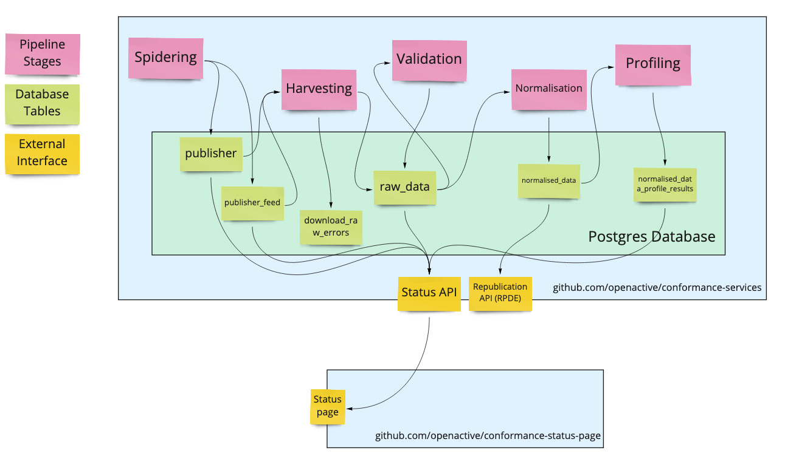

# System Overview

The various components of the OpenActive Conformance Services have been designed to operate relatively independently, but together make a coherent whole.

For a detailed explanation of the data pipeline \(pink cards, below\), see the [Data Pipeline](stage/) documentation.

To understand the database tables, see the documentation for the stages that each one is connected to.

